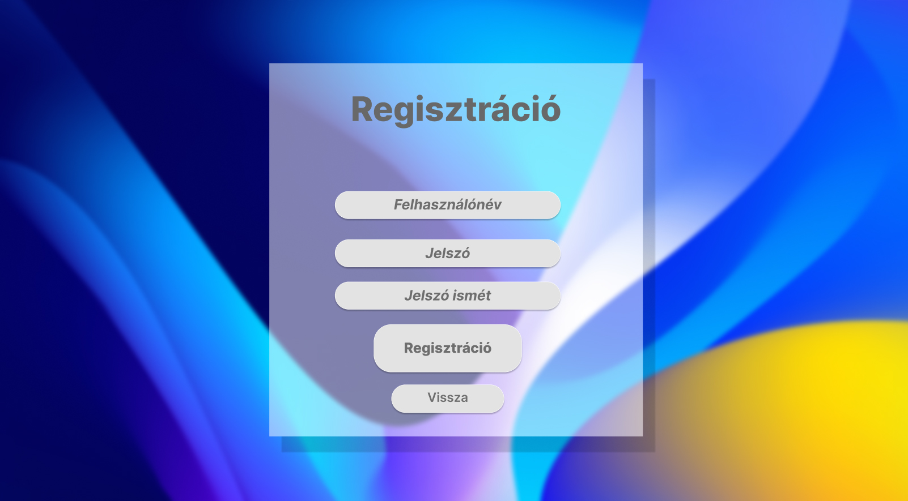
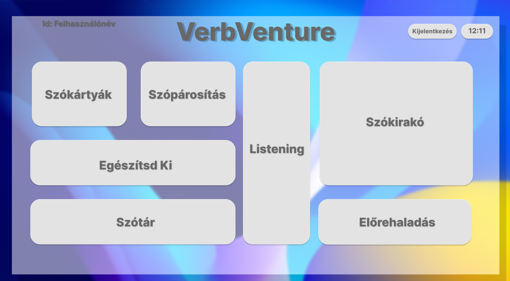
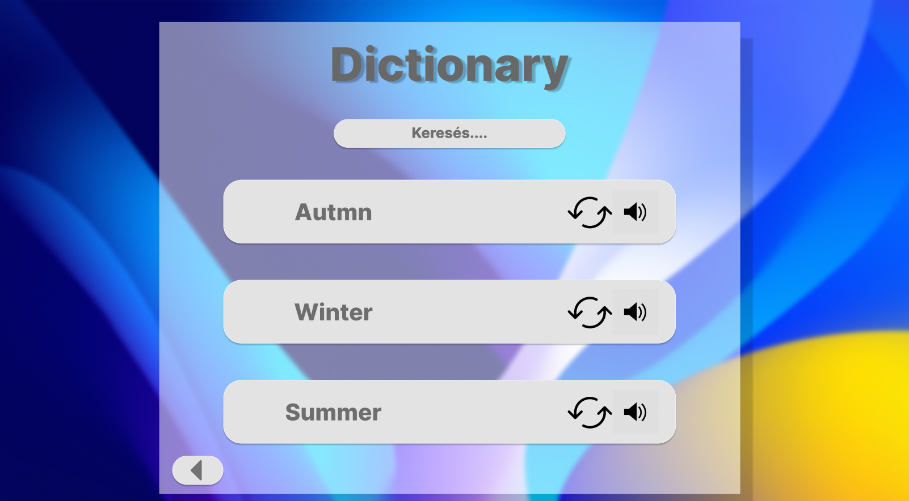
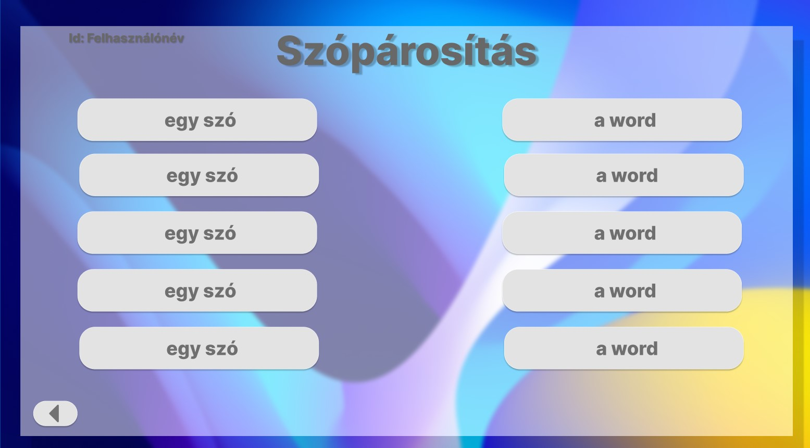

## Képernyőtervek

A képernyőtervek figma segítségével készültek, a figma project elérési helye: 

https://www.figma.com/file/umM7rSt7kiYehTDn5hFwPQ/VerbVenture
* Bejelentkezési képernyő:

* Regisztrációs képernyő:

* Főmenü/Landing Page:

* Előrehaladás képernyője:

* Feladattípusok Képernyőtervei:

