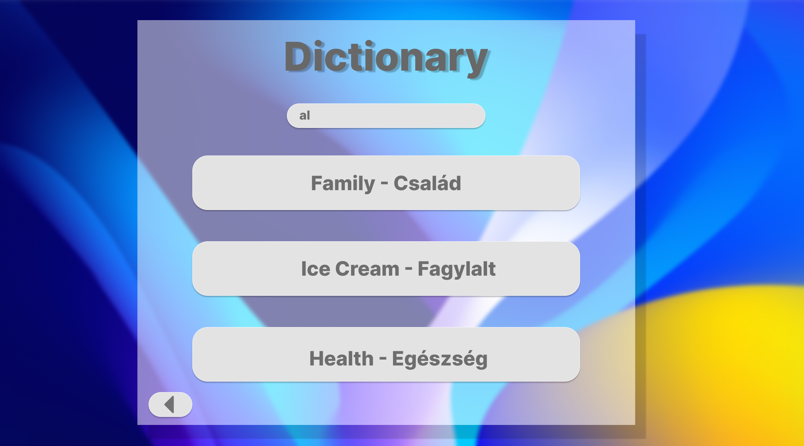

# Józsi bácsi Story 1 (Login)
Józsi bácsi elhatározta, hogy meglátogatja Nagy Britanniában élő unokáját. 
Meg szeretné lepni azzal, hogy megtanul pár alap angol szót, hogy így köszöntse. 
Ezért miközben vár a repülőgépre megnyitja a böngészőt és rákeres a VerbVenture™ online angol oktató alkalmazásra. 
Az alkalmazásról egyik ismerősétől hallott. Miután betöltött az alkalmazás a bejelentkezési oldalra kerül. 
Ezen az oldalon egy felhasználóvet és jelszót kell megadni.
Felhasználónévnek beírja, hogy Józsi Bácsi, jelszónak pedig a születési dátumát, majd rákattinit a bejelentkezés gombra.
Ezután egy hibaüzenet jelenik meg, amin az áll, hogy nincs ilyen nevü felhasználó regisztrálva. 
Az alkalmazás felajánlja, hogy hozzon egy fiókot létre.

# Józsi bácsi Story 2 (Regisztráció...)
Józsi bácsi nagyon szeretné használni a VerbVenture™ angol oktató alkalmazást.
Meg is nyitotta a böngészőjében, viszont amikor bejelentkezni próbált akkor 
szembesült vele, hogy nincs felhasználói fiókja, így nem tudja használni.
Az alkalmazás felajánlotta neki, hogy hozzon egy fiókot létre, amit ő el is fogadott.

Most a regisztrációs felületre került. Itt egy tetszőleges felhasználónevét és jelszót kell megadni,
a jelszót azért, hogy biztosan ne legyen elgépelve mégegyszer meg kell adni.

Józsi bácsi beírja a 'Józsi Bácsi' nevet a felhasználónévhez, majd a 2 jelszó mezőbe a születési dátumát és rákattinit a regisztráció gombra.
Ekkor egy hibaüzenet felugrik, hogy a felhasználnév nem tartalmazhat szóközt és ékezetes karaktereket.

# Józsi bácsi Story 3 (Regisztráció folytatása...)
Józsi bácsi szeretné használni a VerbVenture™ angol oktató alkalmazást.
Meg is nyitotta a böngészőbe, viszont bejelnetkezni nem sikerült, mivel nem rendelkezik felhasználói fiókkal.
Az előbb megpróbált egyet lérehozni, viszont sajnos nem sikerült.
Felhasználónévnek Ő a 'Józsi Bácsi' nevet adta meg, de az alkalmazás nem engedélyezi a szóközzel és ékezetes betűkkel 
rendelkező neveket. Ezért próbál egy újat kitalálni ami már megfelelő formátumú.

Józsi bácsi kijelöli az előbb beírt 'Józsi Bácsi' nevet a felhasználónév mezőből és kitörli azt.
Ezután beírj a 'JozsiBacsi' nevet magabiztosan, biztos benne, hogy mostmár helyes lesz.
Rákattint a bejelentkező gombra, ekkor egy újabb hibaüzenet fogjada. 'Ez a felhasználnév már használatban van!'
Ekkor mérgében a telefont a földhöz vágja, és úgy látszik, hogy betört a képernyője.

# Józsi bácsi Story 4 (Regisztráció folytatása...) 
Józsi bácsi szeretné használni a VerbVenture™ angol oktató alkalmazást.
Sajnos viszont nem rendelkezik felhasználói fiókkal, ezért próbál egyet lérehozni.
Előzőleg egy olyan felhasználónevet adott meg, ami már használatban van, és sajnos valószínűleg a telefon képernyője is betört.

Kis idő múlva miután megnyugodott, újra megpróbálkozik a regisztrációval. Mérgében a böngészőt is bezárta, így újra megnyitja azt és újra rákerest a VerbVenture™ alkalmazásra.
Mostmár tanulva abból, hogy felesleges próbál bejelnetkezik, ha nincs fiókja. Eleve a regisztráció gombra kattint.
A felhasználónévhez most egy teljesen egyedit ad meg, a 'KerlekMukodj' nevet, az egyik jelszó mezőbe beírja születési dátum.
A megerőssítő jelszó mezőbe is beírja azt, de mivel a képernyő bevan repedve, így nem érzékeli az egyik karakter lenyomást, és így az kimarad a jelszóból.

Józsi bácsi rákattint a regisztráció gombra, és látja, hogy új hibaüzenet fogadja. Nagyon örül neki, hogy most más hibát kapott.
Elolvassa és látja, hogy a jelszavak nem egyeznek. Kicsit meglepődik, de ettől függetlenül sikernek veszi, hogy már eddig eljutott.

# Gizella Tanárnő Story 1
Gizella Tanárnő az ősz beköszöntének alkalmából szeretne az évszakhoz kapcsoló tananyagot hozzáadni az alkalmazáshoz. 
Elindítja a böngészőt, majd megnyitja a VerbVenture™ angol oktató alkalmazást.
Megjelenik a bejelentkező felület, de ez alapból a diákok számára készült. Ezért a  jobb felső sarokban lévő oktató ikonra kattint, amivel átlép szerkeztő módba. Megadja a felhasználónevét és jelszavát, majd a bejelentkezés gombra kattint.
Ezután megjelenik a fő menü, ahol több opció közül választhat, például lecke hozzáadása, lecke szerkesztése, lecke törlése, szótár szerkesztése. Kiválasztja a 'lecke hozzáadása' opciót. Megjelenik egy új ablak, ahova beírhatja a lecke nevét, és megjelnik az összes szó ami a szótárba szerepel. A szavak mellett van egy bepipálható rublika, amivel hozzárendelheti a szót a leckéhez. Emellett egy szövegbeviteli mező is található, amibe írva keresni tud a szavak között. 
Tanárnő kiválaszz 15 őszhöz kapcoslódó szót, bepipálja a rublikát melletük, majd a 'lecke mentése' gombra kattint. 

# Regisztráció Story

Józsi bácsi izgatottan ül a repülőtéren, hiszen hamarosan felszállhat a Nagy Britanniába tartó repülőgépre, amivel meg tudja látogatni az unokáját. Elhatározta, hogy meglepi azzal, hogy néhány alap angol szót megtanul. Már múlt héten kicsit kételkedve, kikérte a szemközti szomszédja véleményét, aki -spanyol nyelvtanár- hogy szerinte mi a leggyorsabb módja annak, hogy néhány angol szót megtanuljon. Sajnos a közelben nem lakik angol nyelvtanár, így kénytelen az ő tanácsára hagyatkozni. Azt ajánlotta, hogy próbálja ki az online angol oktató alkalmazást, a VerbVenture™-t. 
Megnyomja a bekapcsoló gombot a telefonon, beírja a 4 jegyű feloldó kódot és a telefon kezdőképernyőjére kerül. Rábök az alulról 3. ikonra a Chrome böngészőre. Miután az alkalmazás betöltött, elkezdi begépelni a “VerbVen” kifejezést, mivel már egyszer rákeresett, ezért a böngésző automatikusan felajánlja a “VerbVenture™” találatot, erre rábök. 
Miután betöltött az oldal a bejelentkezési felületre kerül. Itt felhasználónevet és jelszót kell megadnia. Józsi bácsi beírja a felhasználónévnek, hogy “Józsi Bácsi”, valamint születési dátumát jelszónak.  Türelmetlenül rányom a bejelentkezés gombra, de ekkor egy hibaüzenet jelenik meg, amin az áll, hogy nincs ilyen nevű felhasználó regisztrálva. Az alkalmazás a hibaüzenetben felajánlja, hogy hozzon létre egy fiókot. 

Az alkalmazás átirányítja a regisztrációs felületre. Itt egy tetszőleges felhasználónevet kell megadnia, amivel azonosítja majd az alkalmazás. Valamint jelszót is ki kell találnia, amit kétszer is be kell írnia, hogy biztosan ne legyen elgépelve. Józsi bácsi beírja a “Józsi Bácsi” nevet a felhasználónévhez, majd a 2 jelszó mezőbe a születési dátumát és megnyomja a regisztráció gombra. Ekkor egy hibaüzenet megjelenik, hogy a felhasználónév nem tartalmazhat szóköz és ékezetes karaktereket. Rányom az “OK” gombra, amivel bezárja a hibaüzenetet, kijelöli az előbb beírt “Józsi Bácsi” felhasználónevet, és kitörli a mezőből. Ezután beírj a “JozsiBacsi” nevet magabiztosan, biztos benne, hogy most már jó lesz. Rányom a regisztráció gombra, ekkor egy újabb hibaüzenet fogadja. “Ez a felhasználónév már használatban van!” Ekkor kicsit szomorú lesz, úgy érzi, hogy a szemközti szomszédja (Aki spanyol nyelvet tanít), direkt regisztrált a nevével, mert elfelejtette visszaadni a tavaly kölcsönkért ásót. Bezárja az alkalmazást és elmegy inni egy kávét. 

Kis idő múlva, újult energiával visszatér, bár még kicsit szomorúan. Bekapcsolja a telefon képernyőjét, beírja a feloldó kódot, majd újra megnyitja a Chrome böngészőt. A böngésző automatikusan visszatölti az utoljára bezárt lapot, így már eleve a VerbVenture™ alkalmazás oldalára kerül. Tanulva abból, hogy felesleges próbál bejelentkezni, ha nincs fiókja. Eleve a regisztráció gombra kattint. Elkeseredetten, most egy teljesen más felhasználónévvel próbálkozik a  "KerlekMukodj”-el. Az egyik jelszó mezőbe beírja a születési dátumát, a megerősítő jelszó mezőbe is beírja azt, de kicsit rosszul nyom rá a számra, így másik karakternek érzékeli a telefon. Józsi bácsi megnyomja a regisztráció gombot, és látja, hogy újabb hibaüzenet fogadja. Elolvassa és látja, hogy a jelszavak nem egyeznek. Kicsit meglepődik, de ettől függetlenül örül neki, sikernek veszi, hogy már eddig eljutott.
Józsi bácsi türelmesen kitörli mindkét jelszó mező tartalmát. Eszébe jut, hogy lehet nem a legbiztonságosabb a születési dátumát megadni, kutyája nevét és azt, hogy ma milyen nap van. (Hétfő) Újra megnyomja a regisztráció gombot, és örömmel látja, hogy sikeresen regisztrált a VerbVenture™ alkalmazásban.

# Bejelentkezés Story

Józsi bácsi éppen a repülőgépen várakozik, várja a felszállást. Nagy Britanniába tart, hogy meglátogassa az unokáját, úgy gondolta, hogy az út során néhány alap angol szót megtanul, hogy meglepje vele. Az utazás előtt a szemközti szomszédja, aki egy spanyol nyelvtanár, ajánlotta neki a VerbVenture™ online angol oktató alkalmazást, állítása szerint ez egy hatékony módszer a gyors tanulásra.

Megnyomja a bekapcsoló gombot a telefonon, beírja a 4 jegyű feloldó kódot és a telefon kezdőképernyőjére kerül. Rácsatlakozik a repülőgép Wi-Fi hálózatára, majd megnyitja. a Chrome böngészőt. Miután az alkalmazás betöltött, elkezdi begépelni a “VerbVen” kifejezést, mivel már egyszer rákeresett, ezért a böngésző automatikusan felajánlja a “VerbVenture™” találatot, erre rábök.  Gyorsan rátalál, és a bejelentkezési oldalra kerül. Mivel már előzőleg regisztrált az alkalmazásba, így csak bejelentkeznie kell. Beírja a felhasználónevét "KerlekMukodj", és a jelszavát. Bizakodva kattint a bejelentkezés gombra, de sajnos egy hibaüzenet jelenik meg.

A hibaüzeneten az áll, hogy a jelszó helytelen. Kicsit meglepődik Józsi bácsi, de nem adja fel. Gyorsan törli a jelszó mező tartalmát, majd újból begépeli a jelszót. Megnyomja a bejelentkezés gombot, de egy furcsa hiba miatt megszakad az internetkapcsolat, és a böngésző a "nincs internet" hibaüzenetet jeleníti meg. Józsi bácsi vár egy kis időt mielőtt újra próbálkozik.

Miután újra csatlakozik a repülőgép Wi-Fi hálózatához, megnyitja a Chrome böngészőt, amely automatikusan betölti az utoljára bezárt oldalt. Így most rögtön a VerbVenture™ bejelentkező felületére kerül. Beírja a felhasználónevét és jelszavát, majd a bejelentkezés gombra nyom. Ekkor a képernyőn megjelenik az alkalmazás kezdőképernyője. Józsi bácsi szinte megdöbben, felkiált, hogy “Sikerült!”

Most már elkezdheti az angol szavak tanulását, hogy meglepje az unokáját.

# Főmenü Story

Józsi bácsi Nagy Britanniába tartó repülőútja végén döbben rá, hogy sajnos elbóbiskolt, és egyáltalán nem tanult egy angol kifejezést sem! A manóba!

Gyorsan előkapja telefonját, ahol már az általa többször is használni próbált VerbVenture™ alkalmazás köszönti. A már rutinosra begyakorolt bejelentkezés után rögtön a VerbVenture™ széle választékú főmenüjében találja magát.

A bal felső sarokban a felhasználóneve köszön vissza rá, míg jobb felül nemcsak kijelentkezni tud, de az idő is ki van jelezve. "Fantasztikus!" – gondolja magában Józsi bácsi – "Így tanulás közben arra is tudok ügyelni, nehogy túlságosan elteljen az idő."

A középen, nagybetűkkel szedett 'VerbVenture™' felirat (a név mellesleg Józsi bácsinak nagyon tetszik) alatt a lehetőségek valóságos tárháza jelenik meg főhősünk előtt: a szókártyák, szópárosítás, és mondatkiegészítés feladatokon túl Józsi bácsi egy szótárban is kereshet idegen nyelvű szavakra, vagy ellenőrizheti előrehaladását az azt igérő menüben. "Ennyi lehetőség mellett szinte csoda, ha valaki nem tanulna meg angolul" – gondolja magában.

A nagy izgalmakat kipihenése érdekében Józsi bácsi rányom a kijelentkezés gombra, és visszadől aludni.

# Előrehaladás Story

Józsi bácsi, már jól ismert főhősünk egy későbbi alkalom adtán úgy dönt, jó lenne ellenőrini az eddigi tudását, megnézni, mennyire magabiztos már angol ismereteiben.

Ennek érdekében megnyitja a főmenüből az előrehaladás menüpontot, és szemügyre veszi az elétáruló információhalmazt.

Az egyes feladattípusok külön-külön százalékosan vannak osztályozva, tőlük jobbra pedig egy összesített értékelés, és még egy jegy is fel van tüntetve. "Lenyűgöző" – gondolja.
"Az az érdekes, hogy ezt a sok adatot mind el lehet tárolni valahol."

Józsi bácsi elvégez egy pár feladatot, majd izgalommal tér vissza az előrehaladás menüpontba, és örömmel látja, hogy pontszámai számottevően javultak. "Mégsincs hiába a sok tanulás."

Eredményére oly büszke, hogy rányom a nyomtatás menüpontra, és el is küldi unokájának, milyen sokat fejlődött idegen nyelvi tudása.

# Szópárosítás

Józsi bácsinak hivatalos dolga akadt egy kormányablaknál, de oda megérkezve nagy sor fogadta. Sebaj, most, hogy jártas VerbVenture™™ felhasználó lett, nem zavarják az efféle fennakadások.

Előveszi hát telefonját, és megnyitja kedvenc angol nyelvtanuló alkalmazását.

A helyzetből eredően nem szeretne hallásra vagy beszédre fókuszáló feladatokat végezni, ezért inkább rányom a Szópárosítás menőpontra.

Elétárul 10-10 szó, bal oldalt magyar, jobb oldalt angol megfelelőkkel. Feladata egyszerű: a bal és jobb oldalak párosítása. Helytelen párosítás esetén a szó visszaugrik kezdő helyére, helyes párosítás esetén viszont a párok összetapadnak, így Józsi bácsi könnyen átlátja, hol tart az adott feladatban.

Miután minden szót megfelelően párosított, a tovább gombbal új szavakat kérhet.

Így játszva elrepült a komrányablaknál szükséges 16 órás várakozás.

# Szókártyák

asd

# Egészítsd ki

Józsi bácsi elég fáradtan érzi magát, de azért nem akarja ma se elhalasztani az angol nyelv tanulását. "Bár lenne egy kissé könnyebb feladattípus, amivel azért mégis gyakorolhatnék egy kicsit!" — gondolja.

Ekkor eszébe jut, hogy van még pár feladattípus, amit ki se próbált. Előveszi telefonját, megnyitja a VerbVenture™ alkalmazást, és kiváncsian nézi végig az eddig nem ellenőrzött feladattípusok neveit.

Rövid gondolkodás után meglátja a szituációhoz illő feladatot: egészítsd ki. Józsi bácsi rányom az általa könnyűnek érzett feladatra, és örömmel látja, hogy pont olyan feladat tárul elé, mint remélte: egy egyszerű mondatkiegészítés, négy lehetőség felajánlásával. Felül egy angol mondat jelenik meg, melyből hiányzik egy részlet. Alatta 4 gomb jelzi lehetőségeit a továbbhaladásra.

Rányom az egyik gombra, és örömmel látja, hogy az zölden felvillan, majd továbblép egy új feladványra. A következő mondat azonban kicsit nehéz, és sajnos Józsi bácsi rosszul tippel. Örömmel látja azonban, hogy bár téves választ adott, a kérdés nem lép tovább, szimplán pirosan felvillan a rossz válasz, és az alkalmazás lehetőséget kínál számára a helyes válasz kiválasztására.

Józsi bácsi lefekvés előtt még hosszasan fejlesztette angol tudását a mondatkiegészítés feladattal.

# Szókirakó

Józsi bácsi legfiatalabb unokái váratlanul látogatóba jönnek hozzá. Nem készült meglepetéssel, így eltűnődik, mivel kéne legkötni a kicsik figyelmét.

Eszébe jut, hogy a VerbVenture™ alkalmazásban nem csak kemény nyelvfeladatok, hanem képfelismerő, játékos kérdések is vannak. "Remek" — gondolja — "így a kicsit szórakozhatnak, és közben én is tovább fejleszthetem angol tudásomat!"

Betölti a VerbVenture™ alkalmazást, és rányom a szókirakó menüpontra. Felül egy kép jelenik meg, alatta pedig a szó hossza, és néhány betű, melyek között szerepelnek a képen szereplő dolog nevét alkotó betűk is.

A betöltött képet megmutatja unokáinak, akik felismerik a képet, majd Józsi bácsi befejezi a feladatot azzal, hogy angolra fordítja a tippjüket, segítségül hívva a betűket és a szóhosszt jelképező vonalakat. 

# Listening

Józsi bácsi tudja, hogy hallása már nem régi, ezért kiemelkedő fontosságot élvez a nála a hallás utáni helyes szövegértés fejlesztése. Egy fülorvostól való vizit után józsi bácsi beül kocsijába, és céltudatosan készíti elő telefonján a már jól ismert VerbVenture™ alkalmazást.

Bejelentkezik, majd ránavigál a Listening menüpontra. Tudja, hogy ha angolul menni fog a hallás utáni szövegértés, akkor magyarul se lesz túl nagy probléma.

A felül megjelenő gombra nyomva az alkalmazás lejátszik számára egy rövid szöveget, amit józsi bácsi elkezd begépelni a gomb alatti szövegdobozba. Sok időt tölt a listening feladatban, több szöveget is kipróbál, meghallgat, miközben a szövegek nyelvezete egyre nehezedik.

Az idő múlásával azonban megnő a parkoló autóját körülvevő forgalom, így a hangos kocsizajtól Józsi bácsi nehezen érti a feladatot. Elhatározza, hogy inkább hazamegy, és otthon gyakorol tovább.

# Szótár 1

Józsi bácsi, miután sikeresen regisztrált a VerbVenture™ alkalmazásban, elérkezettnek érzi az időt, hogy kipróbálja az alkalmazás szótár funkcióját. Az unokája hamarosan érkezik, és Józsi bácsi szeretne pár kifejezést megtanulni, hogy meglepje vele.

Felveszi a szemüvegét, előveszi a telefonját, majd rányom a főmenüben található "Szótár" opcióra. Egy egyszerű és felhasználóbarát keresőmező tárul elé, ahol már az első betűk beírásával megjelennek a lehetséges találatok.

Józsi bácsi a keresést köszönésekkel kezdi, magyarul begépel párféle köszöntést. (Pl. Szia, Jó Reggelt, Örülök, hogy látlak.) Ahogy gépel, az alkalmazás már dinamikusan mutatja is a lehetséges találatokat, mind angol mind magyar nyelven. A találatok kis kártyákon jelennek meg, amin látható a szó angol és magyar megfelelő.

Most már felkészült arra, hogy az unokáját angol köszöntéssel fogadja, és alig várja, hogy bemutassa az újonnan szerzett tudását.

# Szótár 2

Józsi bácsi éppen egy angol könyvet olvas, amikor ráakad egy olyan szóra, aminek a jelentését nem ismeri. Nem hagyja azonban annyiban a dolgot, azonnal előveszi telefonját, és megnyitja a VerbVenture™ alkalmazást.

A főmenüből kiválasztja a Szótár menüpontot, majd elkezdi begépelni a számára ismeretlen szót. Ahogy gépel, az alkalmazás már dinamikusan megmutatja a lehetséges találatokat, mind angol mind magyar nyelven. A találatok kis kártyákon jelennek meg, amin látható a szó angol és magyar megfelelő.

Miután megtudta, hogy mit jelent a szó Józsi bácsi elrakja a telefonját, és folytatja az olvasást, most már nagyjából teljesen értve a mondatot.

# Szótár 3 (Tematikus Szavak)

Józsi bácsi, már rutinos VerbVenture™™ felhasználó, éppen egy kis szünetet tart a nyelvtanulásban, viszont nagyon kíváncsi, hogy milyen szavak találhatók az alkalmazás szótárában. A konyhaasztalnál ül, kényelmesen elhelyezkedik, előveszi telefonját, és megnyitja a VerbVenture™ alkalmazást.

A főmenüből kiválasztja a “Szótár” opciót. Betölt a szótár felülete, felül található egy keresőmező, amivel mind angolul mind magyarul kereshetőek szavak. Alatta pedig kis kártyákon megjelennek a talált szavak.

Józsi bácsi tudja, hogy a VerbVenture™™ alkalmazás szótárában már tematikusan is kereshet szavakat. Kereshet a “Színek" "Köszöntések" "Ételek" és "Állatok” kategóriájában. Először a “Színek”-et írja be, ekkor megjelenik az összes színhez kapcsolódó szó amit az alkalmazás tartalmaz. Ahogy a “sima” keresésnél úgy itt is, a kártyákon megjelenik a szó angol és magyar megfelelője is.

írni kezdi az első szót, amire kíváncsi. Angolul megszokottan beírja a "Colors" (színek) szót. Már ahogy gépel, az alkalmazás megjeleníti az első találatokat, és Józsi bácsi elégedetten konstatálja, hogy mind az angol, mind a magyar szó megjelenik. Józsi bácsi elégedetten bólint, és örül, hogy ezeket a szavakat ismerve még színesebbé teheti az angol beszélgetéseit a családjával.

Most, hogy megismerte az alkalmazás szótárát, Józsi bácsi készen áll arra, hogy folytassa a tanulást, és felkészülten érkezzen az unokájával való találkozásra.

